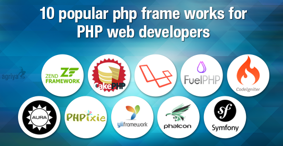

# Séance 1 : Introduction


La présentation : [https://presentations.davidannebicque.fr/r319.html](https://presentations.davidannebicque.fr/r319.html)


## Présentation

Découvrir et appréhender un framework PHP web.

## Pré-requis

* PHP
* Programmation Orientée Objet
* Structure MVC
* Base de données

## Rappels des concepts du MVC

### C: Controller / Contrôleur

C'est lui qui reçoit l'interaction (la demande/**request**) du visiteur. Il se charge de récupérer les éléments nécessaires auprès du/des modèle(s). Il transmets toutes les données nécessaires à la vue.

### V: View / Vue

C'est lui qui apporte la réponse (**response/render**) au visiteur. Une vue peut être une page web, un fichier pdf, ... Ne se préoccupe que de l'affiche des informations, n'assure aucun traitement

### M: Model / Modèle

C'est lui qui s'occupe de récupérer et préparer les données. Le modèle peut être en lien avec une base de données. Le modèle peut être en lien avec des API. Le modèle prépare les données pour qu'elles soient facilement manipulables par la vue.

## Notion de Framework

### Définition générale

En programmation informatique, un framework ou structure logicielle est un ensemble cohérent de composants logiciels structurels, qui sert à créer les fondations ainsi que les grandes lignes de tout ou d’une partie d’un logiciel (architecture). Un framework se distingue d’une simple bibliothèque logicielle principalement par :

* son caractère générique,&#x20;
* faiblement spécialisé,&#x20;
* contrairement à certaines bibliothèques ;&#x20;

Un framework peut à ce titre être constitué de plusieurs bibliothèques chacune spécialisée dans un domaine. Un framework peut néanmoins être spécialisé, sur un langage particulier, une plateforme spécifique, un domaine particulier : reporting, mapping, etc. ;

Le cadre de travail (traduction littérale de l’anglais : _framework_) qu’il impose de par sa construction même, guidant l’architecture logicielle voire conduisant le développeur à respecter certains patterns (modèle de conception) ; les bibliothèques le constituant sont alors organisées selon le même paradigme.

### Framework Orienté Objet

Un framework dit orienté objet est typiquement composé de classes mères qui seront dérivées et étendues par héritage en fonction des besoins spécifiques à chaque logiciel qui utilise le framework.

Le développeur qui utilise le framework pourra personnaliser les éléments principaux du framework par extension, en utilisant le **mécanisme d’héritage** : créer des nouvelles classes qui contiennent toutes les fonctionnalités que met en place le framework, et en plus ses fonctionnalités propres, créées par le développeur en fonction des besoins spécifiques à son application.

| Avantages                                                                                                                                                                                                                                                                                                                                                      | Inconvénients                                                                                                                                                                                                                                                                                       |
| -------------------------------------------------------------------------------------------------------------------------------------------------------------------------------------------------------------------------------------------------------------------------------------------------------------------------------------------------------------- | --------------------------------------------------------------------------------------------------------------------------------------------------------------------------------------------------------------------------------------------------------------------------------------------------- |
| 

<ul><li>Pour éviter des erreurs dans l’organisation des appels</li><li>Éviter les appels directs aux commandes PHP</li><li>Préférer les versions des Frameworks qui apportent leur lot de contrôles.</li><li>Plus grand portabilité du code</li><li>Ne pas réinventer la roue</li><li>La gestion des formulaire, des utilisateurs, ...</li></ul> | 

<ul><li>Apprentissage d’une couche supplémentaire</li><li>La majorité des fonctionnalités PHP sont redéfinies</li><li>Généralement apprentissage d’un moteur de template</li><li>Apprentissage de l’utilisation du framework choisit : ses classes, ses objets, sa logique !</li></ul> |

Article comparatifs des 10 frameworks PHP les plus populaires de 2019: [https://coderseye.com/best-php-frameworks-for-web-developers/](https://coderseye.com/best-php-frameworks-for-web-developers/)

## Symfony

* Framework MVC en PHP 5 (V2), PHP 7 (V3, V4 et V5 ), PHP8 (V6) libre
* Développé en 2005 par la société Sensio pour répondre à ses besoins
* Division de la société Sensio en deux entités l’agence Web et l’entreprise qui soutient et maintient Symfony : SensioLabs, dirigée par Fabien Potencier, l’auteur de Symfony
* Framework français !, De renommée mondiale
* Premier framework en France et en Europe

### SYMFONY : AVANTAGES

* Connectable à presque tous les SGBD
* De nombreux Bundles, contributeurs, utilisateurs
* Moteur de template puissant et simple
* Depuis la V4, Symfony est très léger et très rapide


Toutes les informations sur l'évolution du framework : [https://symfony.com/releases](https://symfony.com/releases)


### Symfony V4 : Un retour aux bases

Avec sa version 4 (et suivante), Symfony à pris un virage important par rapport aux précédentes versions, et se rapproche des "standards" de la majorité des framework, mais à aussi grandement optimisé son poids et sa vitesse d'exécution. Dans une grande logique de simplification Symfony à également automatisé de nombreux mécanismes qui auparavant auraient impliqués de nombreuses lignes de configuration.

#### SKELETON ET FLEX

La version **Skeleton** de Symfony : Apporte un framework Symfony très léger, avec le minimum pour faire fonctionner un controller.

La version 4 de Symfony introduit Flex qui est un gestionnaire de "recipes" (recettes), qui permet l'ajout de fonctionnalité à Symfony (gestionnaire de vue, de base de données, d'email, ...) avec un mécanisme d'auto-configuration de ces "bundles". Cela permet donc de fournir par défaut un framework très léger, avec une grande facilité pour lui ajouter tous les composants nécessaires, sans en mettre plus que nécessaire.

Par défaut Symfony version Skeleton ne sais rien faire ! Par contre, il n'embarque pas des dizaines de Bundles dont vous n'aurez peut être jamais besoin (fonctionnement des versions 2 et 3 avec plus de 46 bundles par défaut, contre 10 aujourd'hui).

Grâce à Flex vous installez rapidement le nécessaire pour répondre à votre projet.

### &#x20;Symfony V5 : Continuer vers la simplification et la standardisation 

Avec sa version 5 (et suivante), Symfony continue sa simplification en facilitant l'usage de nombreux composants redéfinis et devenus génériques.


Une lecture intéressante sur la logique d'évolution du framework Symfony : [https://www.disko.fr/reflexions/technique/symfony-4-4-5-0-les-nouveautes-venir/](https://www.disko.fr/reflexions/technique/symfony-4-4-5-0-les-nouveautes-venir/)


## Installations (SF6)

### Configuration requise pour votre serveur

* Un serveur Web
* PHP 8.1 ou supérieur
* [Git (différent de GitHub)](https://git-scm.com/)
* Le gestionnaire de dépendance [Composer](https://getcomposer.org/)
* ou Le nouveau gestionnaire d'installation de Symfony : [https://symfony.com/download](https://symfony.com/download)
* Une maîtrise de son système d'exploitation ! (fichiers cachés, variables PATH, php.ini, console...)


Vous pouvez suivre aussi les éléments de la documentation officielle : [https://symfony.com/doc/current/setup.html](https://symfony.com/doc/current/setup.html)


