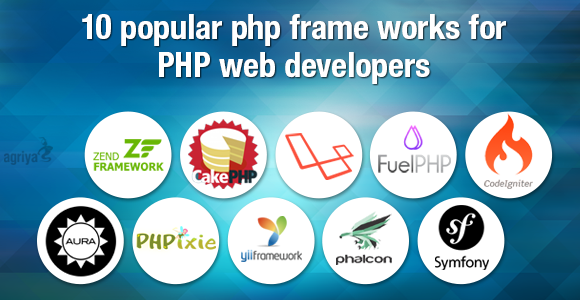

# Séance 1 : Introduction & Eco-système Symfony


La présentation : [https://presentations.davidannebicque.fr/r319.html](https://presentations.davidannebicque.fr/r319.html)


## Présentation

Découvrir et appréhender un framework PHP web.

## Pré-requis

* PHP
* Programmation Orientée Objet
* Structure MVC
* Base de données

## Le concept du MVC


Le concept de programmation MVC consiste à séparer les différentes parties d'un projet web en trois parties distinctes : le modèle, la vue et le contrôleur. Le modèle représente les données et la logique métier, la vue représente l'interface utilisateur et le contrôleur gère les interactions entre le modèle et la vue. Le contrôleur reçoit les demandes de l'utilisateur, récupère les données nécessaires auprès du modèle et les transmet à la vue pour affichage.

L'intérêt d'utiliser le concept de programmation MVC est de séparer les différentes parties d'un projet web en trois parties distinctes, ce qui permet une meilleure organisation et une plus grande facilité de maintenance du code. En séparant la logique métier, l'interface utilisateur et les interactions entre les deux, il est plus facile de faire des modifications sans affecter les autres parties du code. Cela permet également une meilleure collaboration entre les développeurs travaillant sur le même projet.

### C: Controller / Contrôleur

C'est lui qui reçoit l'interaction (la demande/**request**) du visiteur. Il se charge de récupérer les éléments nécessaires auprès du/des modèle(s). Il transmets toutes les données nécessaires à la vue.

### V: View / Vue

C'est lui qui apporte la réponse (**response/render**) au visiteur. Une vue peut être une page web, un fichier pdf, ... Ne se préoccupe que de l'affiche des informations, n'assure aucun traitement

### M: Model / Modèle

C'est lui qui s'occupe de récupérer et préparer les données. Le modèle peut être en lien avec une base de données. Le modèle peut être en lien avec des API. Le modèle prépare les données pour qu'elles soient facilement manipulables par la vue.

## Notion de Framework

### Définition générale

En programmation informatique, un framework ou structure logicielle est un ensemble cohérent de composants logiciels structurels, qui sert à créer les fondations ainsi que les grandes lignes de tout ou d’une partie d’un logiciel (architecture). Un framework se distingue d’une simple bibliothèque logicielle principalement par :

* son caractère générique,
* faiblement spécialisé,
* contrairement à certaines bibliothèques ;

Un framework peut à ce titre être constitué de plusieurs bibliothèques chacune spécialisée dans un domaine. Un framework peut néanmoins être spécialisé, sur un langage particulier, une plateforme spécifique, un domaine particulier : reporting, mapping, etc. ;

Le cadre de travail (traduction littérale de l’anglais : _framework_) qu’il impose de par sa construction même, guidant l’architecture logicielle voire conduisant le développeur à respecter certains patterns (modèle de conception) ; les bibliothèques le constituant sont alors organisées selon le même paradigme.

### Framework Orienté Objet

Un framework dit orienté objet est typiquement composé de classes mères qui seront dérivées et étendues par héritage en fonction des besoins spécifiques à chaque logiciel qui utilise le framework.

Le développeur qui utilise le framework pourra personnaliser les éléments principaux du framework par extension, en utilisant le **mécanisme d’héritage** : créer des nouvelles classes qui contiennent toutes les fonctionnalités que met en place le framework, et en plus ses fonctionnalités propres, créées par le développeur en fonction des besoins spécifiques à son application.

<table><thead><tr><th>Avantages</th><th>Inconvénients</th><th data-hidden></th></tr></thead><tbody><tr><td>Pour éviter des erreurs dans l’organisation des appels</td><td>Apprentissage d’une couche supplémentair</td><td></td></tr><tr><td>Éviter les appels directs aux commandes PHP</td><td>La majorité des fonctionnalités PHP sont redéfinies</td><td></td></tr><tr><td>Préférer les versions des Frameworks qui apportent leur lot de contrôles.</td><td>Généralement apprentissage d’un moteur de template</td><td></td></tr><tr><td>Plus grand portabilité du code</td><td>Apprentissage de l’utilisation du framework choisit : ses classes, ses objets, sa logique !</td><td></td></tr><tr><td>Ne pas réinventer la roue</td><td></td><td></td></tr><tr><td>La gestion des formulaire, des utilisateurs, ...</td><td></td><td></td></tr></tbody></table>



Article comparatifs des 10 frameworks PHP les plus populaires de 2019: [https://coderseye.com/best-php-frameworks-for-web-developers/](https://coderseye.com/best-php-frameworks-for-web-developers/)

## Symfony


* Framework MVC en PHP 5 (V2), PHP 7 (V3, V4 et V5 ), PHP 8.1 (V6) libre
* Développé en 2005 par la société Sensio pour répondre à ses besoins
* Division de la société Sensio en deux entités l’agence Web et l’entreprise qui soutient et maintient Symfony : SensioLabs, dirigée par Fabien Potencier, l’auteur de Symfony
* Framework français !, De renommée mondiale
* Premier framework en France et en Europe

### SYMFONY : AVANTAGES

* Connectable à presque tous les SGBD
* De nombreux Bundles, contributeurs, utilisateurs
* Moteur de template puissant et simple
* Depuis la V4, Symfony est très léger et très rapide



Toutes les informations sur l'évolution du framework : [https://symfony.com/releases](https://symfony.com/releases)


### Symfony V4 : Un retour aux bases

Avec sa version 4 (et suivante), Symfony à pris un virage important par rapport aux précédentes versions, et se rapproche des "standards" de la majorité des framework, mais à aussi grandement optimisé son poids et sa vitesse d'exécution. Dans une grande logique de simplification Symfony à également automatisé de nombreux mécanismes qui auparavant auraient impliqués de nombreuses lignes de configuration.

#### SKELETON ET FLEX

La version **Skeleton** de Symfony : Apporte un framework Symfony très léger, avec le minimum pour faire fonctionner un controller.

La version 4 de Symfony introduit Flex qui est un gestionnaire de "recipes" (recettes), qui permet l'ajout de fonctionnalité à Symfony (gestionnaire de vue, de base de données, d'email, ...) avec un mécanisme d'auto-configuration de ces "bundles". Cela permet donc de fournir par défaut un framework très léger, avec une grande facilité pour lui ajouter tous les composants nécessaires, sans en mettre plus que nécessaire.

Par défaut Symfony version Skeleton ne sais rien faire ! Par contre, il n'embarque pas des dizaines de Bundles dont vous n'aurez peut être jamais besoin (fonctionnement des versions 2 et 3 avec plus de 46 bundles par défaut, contre 10 aujourd'hui).

Grâce à Flex vous installez rapidement le nécessaire pour répondre à votre projet.

### Symfony V5 : Continuer vers la simplification et la standardisation

Avec sa version 5 (et suivante), Symfony continue sa simplification en facilitant l'usage de nombreux composants redéfinis et devenus génériques.


Une lecture intéressante sur la logique d'évolution du framework Symfony : [https://www.disko.fr/reflexions/technique/symfony-4-4-5-0-les-nouveautes-venir/](https://www.disko.fr/reflexions/technique/symfony-4-4-5-0-les-nouveautes-venir/)


## Installations (SF6)

### Configuration requise pour votre serveur

* Un serveur Web
* PHP 8.1 ou supérieur
* [Git (différent de GitHub)](https://git-scm.com/)
* Le gestionnaire de dépendance [Composer](https://getcomposer.org/)
* ou Le nouveau gestionnaire d'installation de Symfony : [https://symfony.com/download](https://symfony.com/download)
* Une maîtrise de son système d'exploitation ! (fichiers cachés, variables PATH, php.ini, console...)


Vous pouvez suivre aussi les éléments de la documentation officielle : [https://symfony.com/doc/current/setup.html](https://symfony.com/doc/current/setup.html)


## Symfony - Eco-système

Symfony nécessite tout un environnement pour fonctionner. Symfony implique aussi différents "langages" et utilise un vocabulaire spécifique (souvent repris dans d'autres frameworks).

### Composer

[_Composer_](https://getcomposer.org/) est un logiciel **gestionnaire de dépendances** libre écrit en PHP. Il permet à ses utilisateurs de déclarer et d'installer les bibliothèques dont le projet principal a besoin. Développé, depuis 2011, par Nils Adermann et Jordi Boggiano (qui continuent encore aujourd'hui à le maintenir), il est aujourd'hui en version 2.

Le logiciel _Composer_ trouve son équivalent pour le front avec _npm_ ou _Yarn_

### ENTITÉ (EQ. DU MODÈLE)

Une _entité_ est une classe PHP ! Elle peut faire le lien avec une base de données, on y déclare les différentes propriétés accessibles; Symfony utilise par défaut un outil de persistence de données : [_Doctrine_](https://www.doctrine-project.org/index.html) pour lier une entité à une table de base de données.

### ORM : OBJECT RELATIONNAL MAPPING

Système permettant de se libérer des requêtes pour la base de données. Il se charge de générer les requêtes à effectuer sur les Entités spécifiées. Il existe plusieurs ORM, dans Symfony, il s'agit de [_Doctrine_](https://www.doctrine-project.org/index.html).

### Repository

Classe PHP qui fait le pont entre une entité et l'ORM, il permet notamment de structurer des requêtes complexes.

### YAML

Format de structuration de données très utilisé dans Symfony, mais on peut utiliser du XML, du PHP ou encore les annotations (PHP 7) ou les attributs (php 8), les fichiers de configurations par défaut sont en YAML.

### Annotations

Commentaire PHP directement dans les classes utiles (controller, entité, ...) interprété par Symfony pour générer des fichiers de configuration ;

### Attributes

Les _Attributes_ sont la nouvelle version des annotations, intégrés nativement dans les versions 8 et supérieures de PHP. Les _Attributes_ sont une forme de données structurées, qui permet d'ajouter des métadonnées à nos déclarations de classes, propriétés, méthodes, fonctions, paramètres et constantes. Ils vont nous permettre de définir de la configuration au plus près du code, directement sur nos déclarations.

### Routes

Les routes permettent de faire un lien entre une URL et un contrôleur.

### Bundles

Sorte de modules Symfony qui peuvent contenir tout et n'importe quoi ; C'est la force de Symfony les modules peuvent fonctionner indépendamment et même sur d'autres structures PHP, autre framework etc.

### ENVIRONNEMENTS

Symfony propose par défaut 2 environnements : _dev_ et _prod_ qui permettent de donner des configs différentes en fonction de l'environnement de travail ;

* dev permet une utilisation sans cache avec des outils de dev comme le profiler ;
* prod lui permet d'utiliser le site avec le cache et sans aucun message d'erreurs.

De plus on peut configurer les différents environnements pour par exemple rediriger tous les mails vers toto@titi.com en dev et laisser le fonctionnement normal pour prod ; pratique pour les debugs. Le changement d'un environnement à un autre se faire en modifiant la ligne suivante dans le fichier ".env" (ou .env.local) :

```env
###> symfony/framework-bundle ###
APP_ENV=dev
```

### Profiler

Le profiler est un outil puissant (et indispensable) pour débuger une application. Par défaut le profiler n'est pas installé. Pour l'ajouter il faut exécuter la commande suivante :

```bash
composer require profiler --dev
```

Le profiler est toujours visible en bas de la page en mode développement.

### Maker

Le maker est un outil puissant pour générer du code, et des éléments dans notre projet. Par défaut le maker n'est pas installé. Pour l'ajouter il faut exécuter la commande suivante :

```bash
composer require maker --dev
```

Il est assez facile de modifier le maker pour que le code généré corresponde exactement à notre projet et nos attentes.

### Moteur de template

Un moteur de template est un "langage", un "outil" permettant d'écrire les vues (partie visible) de manière efficace et rapide. Symfony utilise [_Twig_](https://twig.symfony.com/doc/3.x/) par défaut.
