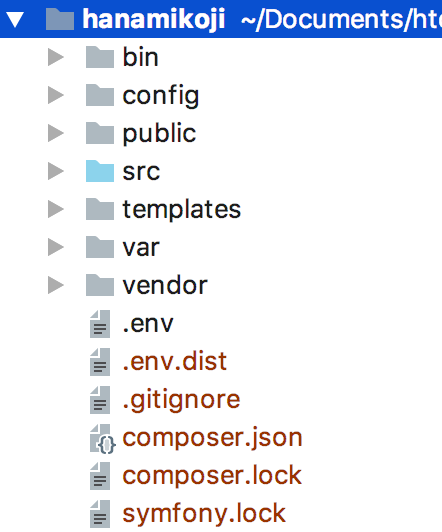

# Séance 2 : Architecture de Symfony

Depuis la version 4, Symfony à grandement simplifié la structure de ses répertoires et à normalisé les appellations pour coïncider avec la pratique de la majorité des framework.

Symfony à également abandonné la notion de Bundle, qui était nécessaire pour développer son projet.

## Architecture globale

* **bin/** : contient la console
* **config/** : contient les configurations des différents bundles, les routes, la sécurité et les services
* **public/** : c'est le répertoire public et accessible du site. Contient le contrôleur frontal "index.php" et les "assets" (css, js, images, ...)
* **src/** : contient votre projet (**M et C** du MVC)
* **templates/** : contient les vues (**V** du MVC)
* **var/** : contient les logs, le cache
* **vendor/** : contient les sources de bundles tiers et de Symfony

## Configuration

Vous remarques des fichiers au format yaml, le format par défaut pour la configuration de Symfony. Vous pouvez aussi remarquer les répertoires dev, prod et test. Ces répertoires permettent de facilement différencier une configuration pour un environnement de développement, pour le site en ligne, ou encore pour un contexte de test.

Par exemple, lorsque l'on développe, on ne souhaite pas réellement envoyer les mails aux usagers, par contre, on souhaite les visualiser. On peut donc configurer ce comportement dans le répertoire dev, pour le bundle de gestion des emails. Un autre exemple est la gestion des logs. En dev, on ne souhaite pas les conserver, mais les afficher, en production, on ne souhaite surtout pas les afficher, mais les stocker dans des fichiers.

Le concept est donc de définir le comportement global quelque soit l'environnement dans le fichier à la racine de config/packages, et de spécifier un comportement en fonction de l'environnement dans les répertoire dev, prod ou test.

## Src

Dans ce répertoire se trouve toute la logique de l'application, les contrôleurs, les modèles, nos classes spécifiques, les services, ...

* Controller/ : Tous les contrôleurs de l'application, accessibles par des routes
* Entity/ : Les classes spécifiques pour la gestion de l'application, des données et des API
* Migrations/ : Contient les fichiers permettant la mise à jour de la base de données pour chaque modification effectuée sur la structure.
* Repository/ : Est très généralement lié à une entité, et permet d'ajouter des requêtes spécifiques.

Tous ces points seront détaillés dans les parties suivantes.

## Principe général de fonctionnement de Symfony

<figure><figcaption>
Principe général de fonctionnement de Symfony (source : <a href="https://symfony.com/doc/current/introduction/http_fundamentals.html#the-symfony-application-flow">https://symfony.com/doc/current/introduction/http_fundamentals.html#the-symfony-application-flow</a>)
</figcaption></figure>
